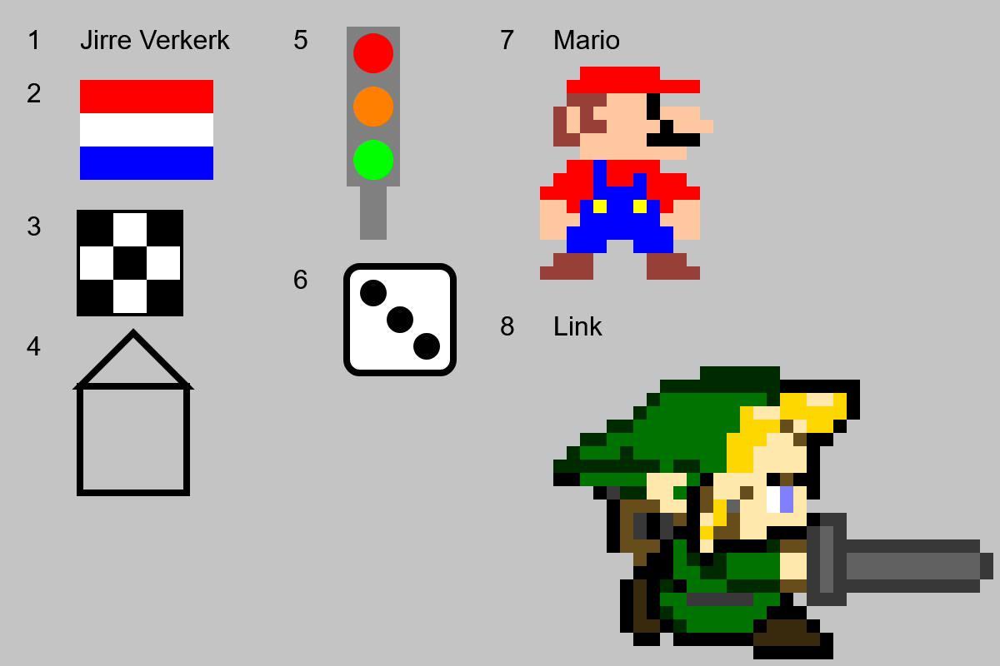

# Hello World
<picture></picture>
 
<picture></picture>

**Opdracht:** Gebruik de tekenfuncties van p5.js om de afbeelding volgens de specificaties hieronder na te tekenen.

## Voorbeeld
<picture></picture>

## Specificaties
Teken de volgende onderdelen naar de canvas, geef hierbij duidelijk aan welke opdracht je hebt weer gegeven door het nummer van de opdracht er bij te zetten.

1. Je volledige naam
2. Een vlag
3. Een schaakbord (inclusief een solide rand)
4. Een transparant huisje
5. Een verkeerslicht
6. Een dobbelsteen met een solide buiten rand
7. Pixel-art Mario, inclusief de naam
8. (bonus) Een ander game-figuur, inclusief de naam