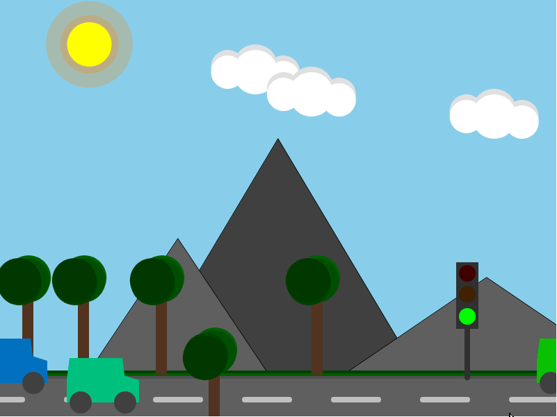

# Dynamisch Landschap
<picture></picture>
 
<picture></picture>

**Opdracht:** Bouw een dynamisch landschap met p5.js.
Maak een animerend landschap waarin een auto afhankelijk van een verkeerslicht van links naar rechts beweegt. Een wolk en een zon bewegen continu over het scherm, met bergen en bomen op de achtergrond.

## Voorbeeld
<picture></picture>

## Specificaties
Gebruik waar mogelijk variabelen. Canvas van minimaal 800 x 600 pixels

**Wolk:**
- Beweegt van rechts naar links en herhaalt zich.

**Zon:**
- Beweegt van links naar rechts en herhaalt zich.

**Bergen en bomen:**
- Statische bergen en bomen.
- Één van de bomen staat dichterbij dan de auto.

**Verkeerslicht:**
- Plaatsing rechtsboven de grond.
- Staten: rood (auto stopt), geel (auto langzaam), groen (auto rijdt).
- Bedienbaar via de Enter-toets. (rood → groen → oranje)

**Auto:**
- Beweegt van links naar rechts wanneer het licht groen of geel is.
- Reset naar links als het scherm wordt verlaten.
- Is getekend met verschillende basisvormen van de p5.js library, zoals rect en circle.
