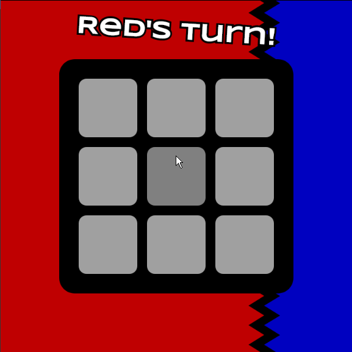

# Boter, Kaas en Eieren
<picture></picture>
 
<picture></picture>

**Opdracht:** Bouw een werkende versie van Boter, Kaas en Eieren met p5.js.

Boter, Kaas en eieren, ook wel "Tic Tac Toe", is een spel voor twee spelers. Het doel is om drie van je eigen symbolen op een rij te krijgen in een 3x3-raster. Het spel eindigt als iemand wint of alle vakjes vol zijn.

## Voorbeeld
<picture></picture>

## Specificaties

**Spelonderdelen:**
- *Speelveld:* Raster van 3x3 cellen.
- *Symbolen:* "Blauw" voor Speler 1, "Rood" voor Speler 2. Andere kleuren mogen ook.
- *Spelers:* Twee spelers, Speler 1 en Speler 2.

**Spelverloop:**
- Start met een leeg raster.
- Speler 1 begint en plaatst "X" in een lege cel.
- Spelers wisselen om de beurt.
- Eindigt als een speler drie op een rij heeft (horizontaal, verticaal, diagonaal) of alle cellen gevuld zijn.
- Winnaar wordt aangekondigd; bij gelijkspel wordt dit ook aangekondigd.
- Herstart mogelijk voor nieuwe ronde.

**Gebruikersinteractie:**
- Klik op een lege cel om je kleur te plaatsen.
- Bord wordt na elke zet bijgewerkt.
- Na afloop kan het spel opnieuw worden gestart.
